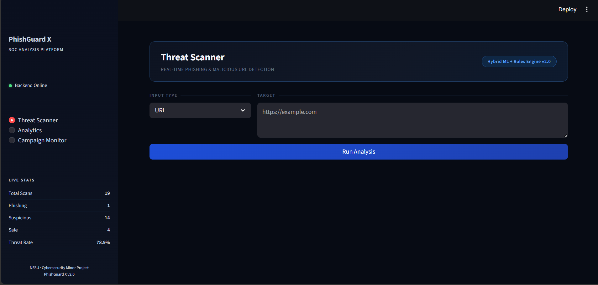
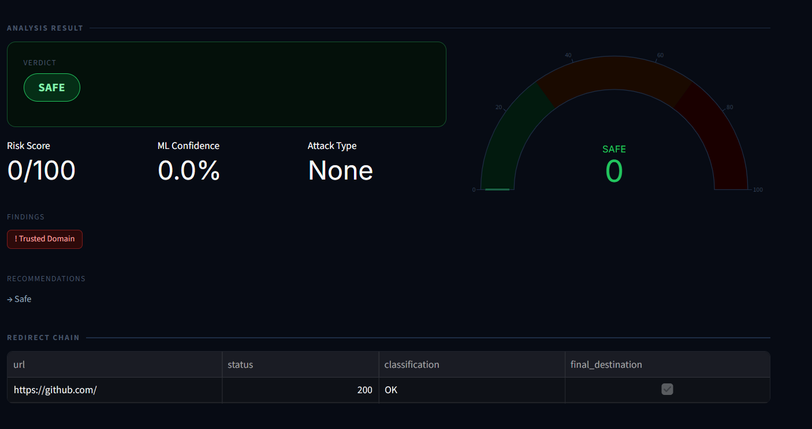
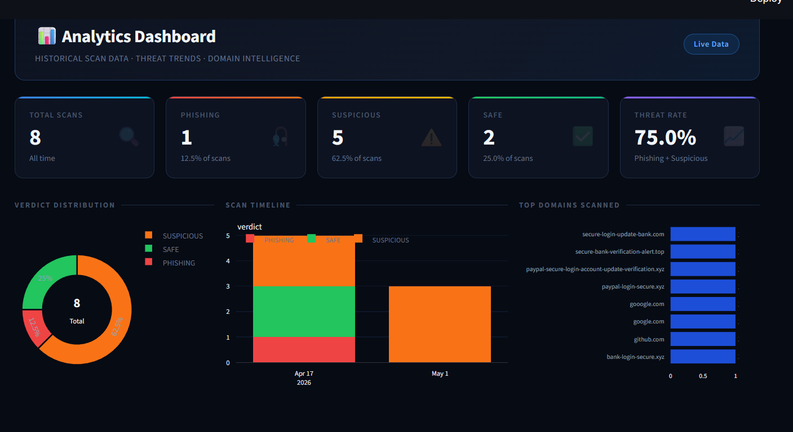
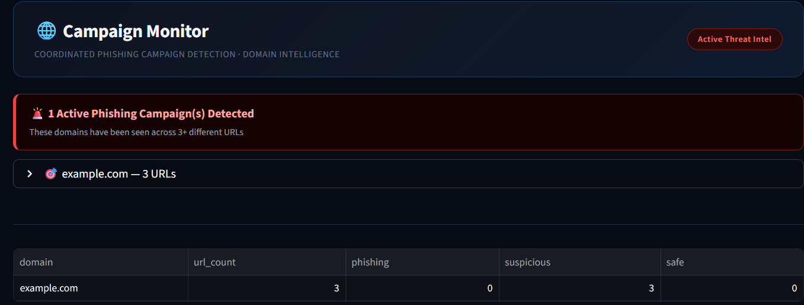
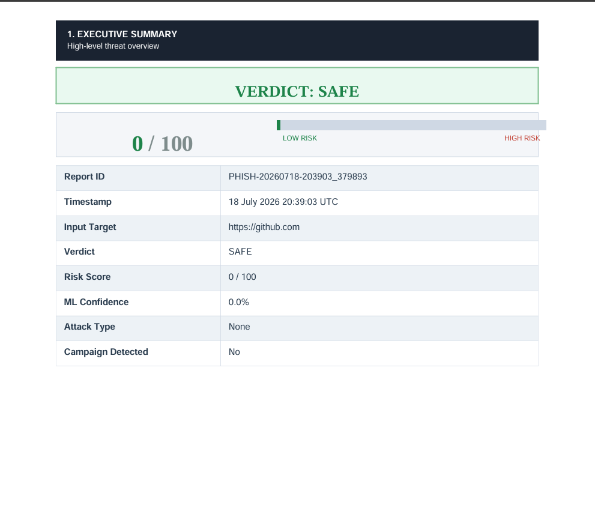

# PhishGuard-X

PhishGuard-X is a hybrid phishing detection system developed in Python that combines Machine Learning and Rule-Based Analysis to detect phishing URLs and malicious websites. The application provides an interactive Streamlit dashboard where users can analyze URLs or QR codes, track redirect chains, detect phishing campaigns, and generate professional forensic PDF reports.

---

## Objectives

- Detect phishing URLs using a hybrid detection approach.
- Combine Machine Learning predictions with rule-based analysis.
- Analyze redirect chains and domain intelligence.
- Generate detailed forensic reports for phishing investigations.
- Provide an interactive dashboard for cybersecurity analysis.

---

## Features

- Hybrid phishing detection using Machine Learning and Rule-Based Analysis
- Real-time URL analysis through an interactive Streamlit dashboard
- Random Forest-based phishing prediction
- Redirect chain tracking
- WHOIS domain age analysis
- Trusted domain verification
- Campaign detection using SQLite
- QR code phishing detection
- Risk score calculation and attack classification
- Analytics dashboard with historical scan statistics
- Automated PDF forensic report generation
- Local scan history

---

## Technology Stack

| Category | Technology |
|----------|------------|
| Programming Language | Python |
| Machine Learning | Scikit-learn (Random Forest) |
| Data Processing | Pandas, NumPy |
| User Interface | Streamlit |
| Database | SQLite |
| Networking | Requests |
| Computer Vision | OpenCV |
| Domain Intelligence | python-whois |
| Report Generation | ReportLab, PyPDF |

---

## How It Works

1. Validate and sanitize the submitted URL.
2. Extract lexical and structural URL features.
3. Track redirect chains to determine the final destination.
4. Verify trusted domains.
5. Perform WHOIS domain age analysis.
6. Apply rule-based phishing detection.
7. Predict phishing probability using a Random Forest model.
8. Detect similar phishing campaigns using SQLite.
9. Decode and analyze QR codes when provided.
10. Calculate the final risk score and classify the attack.
11. Generate a forensic PDF report and display the results on the dashboard.

---

## 📸 Screenshots

| Threat Scanner | URL Analysis |
|----------------|--------------|
|  |  |

| Analytics Dashboard | Campaign Monitor |
|---------------------|------------------|
|  |  |

### PDF Report



---

## Project Structure

```text
PhishGuard-X/
├── screenshots/
│   ├── dashboard.png
│   ├── url_scan.png
│   ├── analytics.png
│   ├── campaign.png
│   └── pdf_report.png
├── analyzer.py
├── campaign_detector.py
├── dashboard.py
├── dataset.csv
├── explainer.py
├── feature_extractor.py
├── gui.py
├── qr_scanner.py
├── redirect_tracker.py
├── reporter.py
├── train_model.py
├── url_model.pkl
├── campaigns.db
├── project_report.pdf
├── requirements.txt
├── README.md
├── LICENSE
└── .gitignore
```

---

## Future Improvements

- Integration with external threat intelligence feeds
- Browser extension for real-time phishing protection
- REST API for automated URL scanning
- Cloud deployment for scalable phishing detection
- Support for additional Machine Learning models

---

## License

This project is licensed under the **MIT License**. See the **LICENSE** file for more information.

---

## Author

**Dipangshu Dey**

